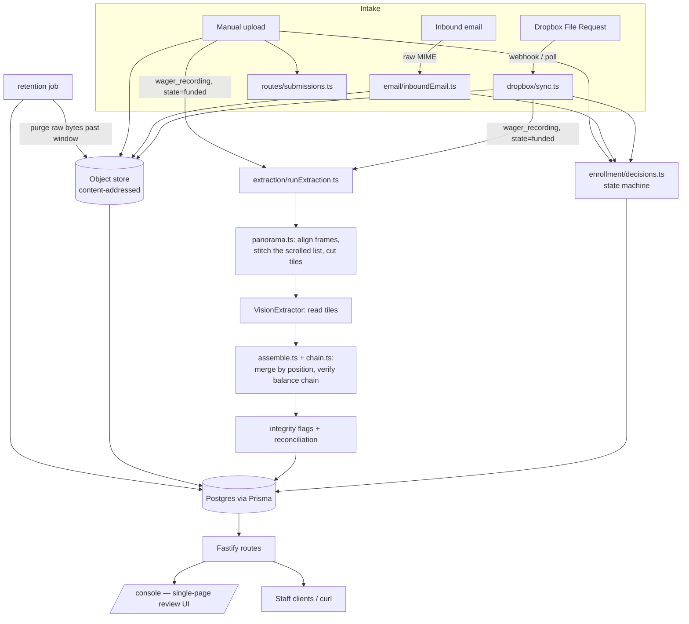

# Architecture

## System diagram

## Milestone map

The PRD (`../prd.md`) defines five milestones; the codebase is organized so each one's logic
lives in its own directory rather than being scattered.

| Milestone | What it does | Where |
|---|---|---|
| **M0 — Archive** | Dropbox File Request ingest, content-addressed object store, submission search | `src/dropbox/`, `src/storage/`, `src/routes/submissions.ts`, `src/routes/participants.ts` |
| **M1 — Lifecycle & email verification** | Enrollment state machine, hash-chained decisions, DKIM-verified email intake, pre-funding checks | `src/enrollment/`, `src/email/`, `src/routes/enrollments.ts`, `src/routes/inboundEmail.ts` |
| **M2 — Wager extraction** | Frame sampling, vision-model row reading, stitching, validation, reconciliation | `src/extraction/` |
| **M3 — Integrity signals** | Encoder/keyframe checks, duplicate-media, shared-rows, submission-gap, manual-intake | `src/integrity/` |
| **M4 — Console & hardening** | Review console, RBAC, exports, retention job, quota monitor | `src/console/`, `src/lib/auth.ts`, `src/exports/`, `src/retention/`, `src/jobs/` |

## Request flow: how a wager recording becomes structured data

1. A participant uploads a screen recording via a Dropbox File Request scoped to their enrollment
   (`dropbox/fileRequests.ts` created the request; the destination path encodes the enrollment id).
2. A Dropbox webhook fires (or the polling fallback catches it) → `dropbox/sync.ts` lists changes
   since the stored cursor, downloads each new file, hashes it, and — inside one DB transaction —
   writes a `MediaAsset` + `Submission`, then calls `enrollment/wagerRecordingIngested.ts` to
   either advance `funded → wager_submitted` or flag `OUT_OF_SEQUENCE`. Only after that commits
   does it purge the Dropbox copy (Dropbox is transport, never storage).
3. If the state advanced and `AUTO_EXTRACT_ON_INGEST=true` (default), `extraction/runExtraction.ts`
   runs immediately — see [Scroll reconstruction](#scroll-reconstruction-how-extraction-works)
   below. Everything lands in `ExtractionRun` / `TransactionRow` / `Reconciliation` /
   `IntegrityFlag`, plus the stitched panorama in the object store.
4. Staff review it at `/console` — a submission's detail view shows the stitched list (or the
   recording) beside the extracted rows; clicking a row highlights exactly where it sits in the
   stitched image and seeks the recording to the frame that showed it.
5. A human (via `POST /enrollments/:id/verify-wager`) makes the wager_submitted → wager_verified
   decision. That call — like every state transition — writes a hash-chained `Decision` row with
   a frozen snapshot of the evidence as it stood at that moment.

## Scroll reconstruction: how extraction works

A screen recording of a scrolling list is a panorama photographed one viewport at a time. The
first version of the extractor sampled a frame every 1.5s, dropped "near-duplicate" frames by
perceptual hash, read each survivor independently, and deduplicated rows by hashing their
content. Against a real recording that lost rows (frames that showed *different* rows hash
almost identically — same layout, different digits), double-counted others (the same row read
slightly differently twice), hallucinated fragments (rows cut in half by the viewport edge),
and — worst — couldn't tell when it was wrong. `docs/extraction-benchmark.md` has the numbers:
4.7% recall on the first real video.

The current pipeline (`src/extraction/`) is built so that row identity is *position in the
list*, which is what it actually is:

1. **Decode densely** (`PANORAMA_FPS`, default 10) — CPU only.
2. **Find the scroll region** (`panorama.ts` → `detectScrollRegion`): pixel rows whose values
   never change across the recording are header/footer chrome; the rest is the list.
3. **Align frames** (`shiftCandidates` + a shortest path over frames): the vertical shift
   between two frames is found by brute-force search at low resolution, then refined at *full*
   resolution with *ink-weighted* scoring (background pixels are 90% of a list UI and would drown
   out the few digits that distinguish one near-identical row from the next; and resampling
   small text by a non-integer factor destroys the match entirely). Placement is a Viterbi over
   frames where an edge may skip up to four frames: an edge spanning *m* frames costs *m*× its
   score plus a velocity-change penalty, so a heavily compressed or partially re-rendered frame
   is stepped over when jumping it is cleaner, while a flick where every frame is mildly blurry
   still chains through consecutive frames. Skipped frames are placed tentatively (for position
   only) and never supply pixels. A frame nothing within range aligns to (scene change, page
   change, flick past a whole screen) starts a new segment and raises `SCROLL_GAP`.
4. **Composite** (`compositeSegment`): each panorama pixel is the median across the best few
   trusted frames covering it, chosen so the row sat at *different* screen heights in them — so a
   floating app widget, the iOS scroll indicator, or a compression smear, all of which stay put
   on screen or show up in a few frames, are a minority the median discards.
5. **Detect row bands** (`detectRowBands`): the whitespace gaps between rows are taller than the
   gaps between lines inside a row; an Otsu split on gap heights finds the separators. This gives
   exact row geometry from the image, independent of the model.
6. **Cut tiles on band boundaries** (`tilePanorama`), overlapping by two rows, each with a pixel
   ruler in the margin. No row is ever cut in half.
7. **Read each tile once** (`VisionExtractor`, Sonnet 5 by default) — rows in order, with a
   constrained `type` vocabulary and separate `description`.
8. **Assemble** (`assemble.ts`): the model's ordered rows map 1:1 onto the tile's bands; the same
   band read by two overlapping tiles is one row. Identical-looking distinct transactions stay
   distinct. If a tile's row count doesn't match its band count (a list header, say), rows are
   assigned to bands by a monotone DP on the model's ruler reading. Tiles with no detectable band
   structure fall back to aligning the overlap as an ordered sequence. Segments that overlap in
   content (a glitch re-captured some rows; a paginated list) are folded by ordered content
   match, and their display order is whichever makes the balance chain link.
9. **Verify the balance chain** (`chain.ts`): every row's before-balance must equal the previous
   row's after-balance, checked in both directions (newest-first vs oldest-first) and, within a
   group of rows sharing a displayed timestamp, as a multiset — the UI's own order inside a
   minute isn't chronological. A break means a row is missing, misread, or genuinely absent from
   the app's own list (a filtered-out adjustment). It is reported as `EXTRACTION_INCOMPLETE`
   with the exact position, and persisted on `Reconciliation` (`chainComplete`, `chainBreaks`,
   `chainStart`, `chainEnd`). This is what makes completeness a measured fact rather than a hope.
10. **Reconcile** against the grant, flag, persist — including each row's exact panorama band and
    the frame/pixel box it maps back to (`locateInFrames`), which is what the console highlights.

Cost tracks row count, not video length: each row is read once. See
[`extraction-benchmark.md`](extraction-benchmark.md) for measured accuracy and the model
evaluation plan.

## The fake/real pattern

Every external system this service talks to is defined as a narrow interface plus two
implementations: a **fake** (in-memory or deterministic, used by default and by the entire test
suite — zero credentials needed) and a **real** one (talks to the actual API). Switching is one
environment variable; no code changes. This exists because, at the time this was built, none of
the PRD's external-dependency decisions were settled yet (D2 hosting, D7 Dropbox account, D12
email provider) — the system needed to be fully testable and demoable without waiting on any of
them.

| Interface | Fake | Real | Switch |
|---|---|---|---|
| `DropboxClient` (`dropbox/types.ts`) | `dropbox/fakeClient.ts` | `dropbox/realClient.ts` | `DROPBOX_MODE` |
| `ObjectStore` (`storage/objectStore.ts`) | `storage/localFsObjectStore.ts` | `storage/s3ObjectStore.ts` | `OBJECT_STORE_DRIVER` |
| `EmailSender` (`email/sender.ts`) | `FakeEmailSender` | `SmtpEmailSender` | `EMAIL_MODE` |
| `VisionExtractor` (`extraction/visionExtractor.ts`) | `extraction/fakeVisionExtractor.ts` | `extraction/claudeVisionExtractor.ts` | `VISION_MODE` |

DKIM verification (`email/dkim.ts`) is the one exception worth calling out: it is **not** faked.
It runs real RSA/DNS verification via `mailauth`; tests inject a fake DNS resolver (serving a
locally generated keypair's TXT record) rather than faking the verification logic itself. Frame
sampling and perceptual hashing (`extraction/ffmpeg.ts`) are likewise real — they shell out to
`ffmpeg`/`ffprobe` and are tested against real generated video files, not mocks.

## Why enrollment, not participant, owns submissions

`Submission` has an `enrollmentId`, not a `participantId`, even though a participant is the
"real" identity. This is load-bearing: signup-email evidence attaches to an enrollment *before*
any grant exists (§6.5 of the PRD), and a participant can have multiple enrollments (different
casinos) simultaneously. Routing intake correctly — a Dropbox path segment, or matching an
inbound email's sender to exactly one pending enrollment — depends on this.

## The decision log

`src/enrollment/decisions.ts` is the single choke point every state transition goes through
(`recordTransition`). It:

1. Validates the transition against the state machine (`enrollment/states.ts`).
2. Builds an evidence snapshot (`buildEvidenceSnapshot`) — every submission's content hash, every
   DKIM verdict, every integrity flag, as they stand *right now*.
3. Hashes that snapshot together with the previous decision's hash (`prevHash`), so the chain is
   tamper-evident — not just an append-only log, but one where altering an old row breaks every
   hash after it.
4. Writes the `Decision` row and updates `enrollment.state` in the same transaction.

This runs for *every* transition, system-driven or human — not just the two PRD calls out as
human decisions (`email_verified → funded`, `wager_submitted → wager_verified`) — so the full
lifecycle is reconstructable from the decision log alone.
